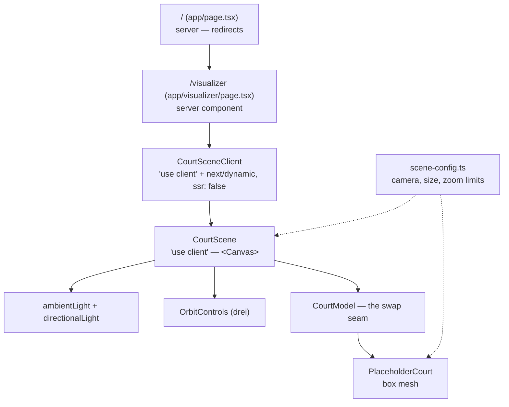

# Architecture

## What it is

The **core visualizer shell**: a single 3D viewport that renders a placeholder
court you can orbit and zoom, plus a clean seam where the real court asset drops
in later.

**Not in scope yet:** court markings, players, the ball, a play timeline, and
saving/loading. Those build on top of this shell.

## How it fits together

## How it works

- **Client-only canvas.** WebGL needs `window`/`document`, so `CourtScene` is
  loaded through `next/dynamic` with `ssr: false`. In Next 16 that option is only
  allowed inside a Client Component, so `CourtSceneClient` exists to hold it.
- **Camera + controls.** `OrbitControls` from `@react-three/drei` gives rotate
  (drag) and zoom (wheel). Pan is disabled (`enablePan={false}`); zoom is clamped
  by `MIN_ZOOM_DISTANCE` / `MAX_ZOOM_DISTANCE`.
- **Scale.** 1 scene unit = 1 metre. The placeholder box is `18 × 1 × 9`, the
  footprint of a real volleyball court, so the camera framing still fits when the
  real asset arrives.
- **Config in one place.** Camera position, FOV, court size, and zoom limits all
  live in `src/lib/court/scene-config.ts`.

## Swapping in the real court

Edit `CourtModel` only. Replace `<PlaceholderCourt />` with the real asset — a
model via `useGLTF(src)`, or a texture on a plane — and pass its path through the
existing `src` prop. `CourtScene`, the page, camera, and controls don't change.

## Related

- [React Three Fiber](https://r3f.docs.pmnd.rs) · [`<Canvas>`](https://r3f.docs.pmnd.rs/api/canvas)
- [drei `OrbitControls`](https://github.com/pmndrs/drei#orbitcontrols)
- [Next.js `next/dynamic`](https://nextjs.org/docs/app/guides/lazy-loading)
- [File reference](./file-reference.md) · [Decisions](./decisions.md)
